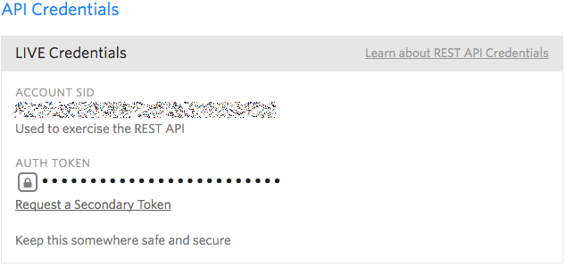
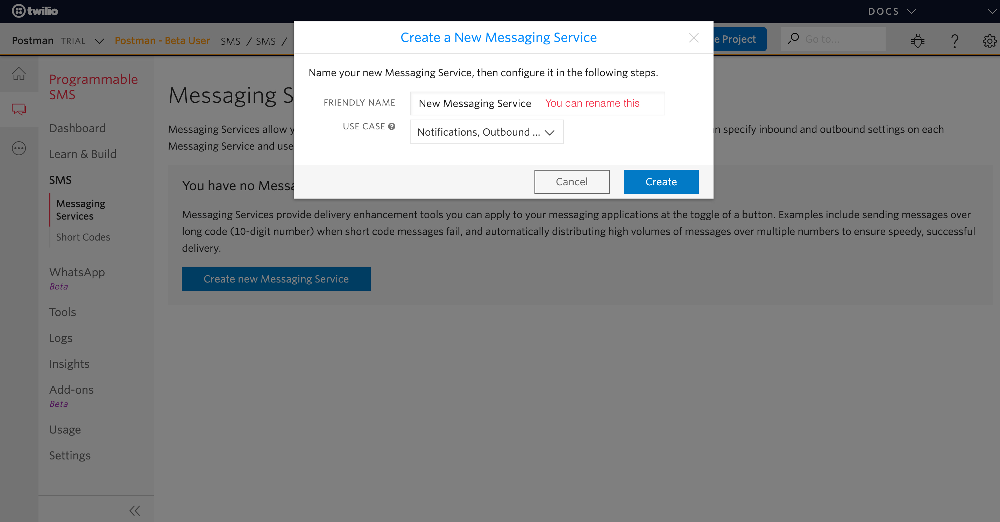

# Before You Start

::: danger
Postman requires a common agency email to be created before you start. Start by contacting your IT administrator to create an email like <noreply@agency.gov.sg>. 
:::

## Create a Common Email
Your login will be the primary email address that we will use to send your emails out to the recipients. Postman does not manage users for an agency. Twilio and WhatsApp credentials will be tied to an agency email account. You might have to contact your IT administrator to create a common email account that allows multiple subscribers.  

### Can I have multiple users from the same agency sharing the same account?
Sharing is caring! All users from the same agency should share one account. The rationale behind our set-up is that communications out to the public should be vetted before you press send. Each agency has its own communication guidelines & policy. We leave it up to the communication team to govern the usage of Postman. If you are sending a message broadcast to the entire country, please make sure you get your use case vetted by the [Ministry of Communications and Information](https://www.mci.gov.sg/ "Ministry of Communications and Information").  

## What are credentials?

Think of credentials as a passcode that you need to enter into a keypad in order to get into a door. We need your credentials to contact Twilio & WhatsApp Business’ API. Different services would have different credential set-up. This guide will teach you how to get them. 

## Setting up your Twilio account
### What is Twilio?
[Twilio](https://www.twilio.com/ "Twilio's Homepage") is a cloud communication service that allows the users to send messages through an Application Program Interface (API).

### How is Postman different from Twilio?
We took our learnings from sending messages en masse to build **a stronger and better Postman**, so you don't have to worry about tweaking the pipes to optimise sending messages in bulk. 

1. **UI** 
    * Postman provides a user friendly interface for users to easily access what Twilio has to offer. 

2. **API**
    * Optimises the **rate limit** to send messages in bulk
    * Allows the user to **cancel** the campaign 
    * Allows the user to **retry** for messages that encounter errors during the first attempted delivery

### How can I sign-up for a Twilio account?
You can go to [Twilio.com](https://www.twilio.com/ "Twilio's Homepage") to sign up for an account. Twilio provides simple and flexible [pricing plans](https://www.twilio.com/pricing "Twilio's Pricing") for different tiers of users. 

| Payment Schemes          | What do you need?                  | 
| :-----------------------| :--------------------------------  | 
| Pay-as-you-go           | Corporate credit card              | 
| Volume discount         | Procure by contacting Twilio sales | 
| Committed-use discounts | Procure by contacting Twilio sales | 

### Where can I find credentials on the Twilio console?

### 1. Account SID & Auth Token
Your credentials should be on the dashboard when you login to Twilio's console.  

An alternative way to access your credential is through **Project > Project Settings > API Credentials**.

::: tip
**Project level vs. subproject level credentials**

Agencies will be billed at the project level, but subproject level allows you to track usage specifically for your group. This is particularly useful for a large agency with many users. Your agency might ask you to create a subproject in Twilio to track your usage. An example would be **MOE** at the **project level** and **Course: ecology 101** at the **subproject level** for ecology 101's teacher to send SMS to parents. 

:::

If you fall under a subproject, you need to navigate to **Project > Project Settings > Subproject > "Subproject name like Course: ecology 101" > Settings > General** to obtain your subproject SID. Twilio console will indicate that you are viewing settings under a subproject using an orange font on the navigation bar. 

### 2. Set up a Standard API Key

Click on **Create new API Key**.

Create a new **standard** API key. You can rename the friendly name. 

We need your **SID** and **secret** for Postman. Please keep these safe. Remember to save the **secret** somewhere before you click on **Done**. 

### 3. Set up Messaging Service

Click on **Create new Messaging Service**.

Create a **new messaging service**. You can rename the friendly name. 

Select drop the message & press save. 

Go back to **SMS > Messaging Service**. You will see the newly created messaging service. You can click on it to buy a phone number. 

::: tip
**Upgrade your Trial account to buy a number**

If you are using a trial account and did not put a corporate credit card under billing then this is as far as you can go. You need to complete the upgrade before you can buy a number. 

:::

### 4. Buy a number
You can use a US number and mask the number with an [alphanumeric sender ID](https://support.twilio.com/hc/en-us/articles/223181348-Getting-Started-with-Alphanumeric-Sender-ID-for-Twilio-Programmable-SMS/
 "Twilio alphanumeric sender ID"). Singapore number is only needed for 2-way SMS. Postman will support 1-way SMS at the start. 

You need to purchase a phone number to start using Postman. 

You need to complete a regulatory bundle first before you can buy a number. It will ask for an ID and business details for verification. 

Once your application for regulatory bundle has been approved then you can search for a phone number based on the country code. 

Singapore phone number is $75 per month. We recommend that you buy a US phone number which is $1 per month if you are not doing 2-way messaging. SMS cost depends on the country code of the phone number. Please take note that a US phone number might cost more to send SMS. 

### 5. Manage Phone number
Go to **Phone Numbers** to buy a new number and select a number. This will be the number that we will use to send your messages. 

::: danger
Do not go into **Release Numbers**. Release a number means that you are returning the phone number that you have purchased back to Twilio. This is irreversible. You will be charged again if you purchase a new number. 
:::

## Setting up your WhatsApp Business account
The following info is from [Facebook WhatsApp Documentation](https://developers.facebook.com/docs/whatsapp/business-management-api "Facebook WhatsApp Documentation"). 

The WhatsApp Business Management API uses Facebook Graph API endpoints. To interact with Facebook Graph API, you will need to register a Facebook app.

### Registering your App
We recommend this setup to be done by an admin in the Business Manager containing your WhatsApp Business Accounts. This will avoid permission errors.

1. Register a Facebook app on the Facebook Developers website using your personal profile (don’t worry, the app will belong to the Business Manager in the end).
2. Go to https://developers.facebook.com/apps/your-app-id/settings/advanced to import the app into your Business Manager. The Business Manager you use should contain your WhatsApp Business Accounts. Make sure to replace your-app-id with your actual app ID.
3. Check for additional instructions in the app configuration, especially those related to GDPR that might apply to your specific case.

For more detailed information about creating a developer account, registering your app, roles, development mode or live mode, please see the App Development documentation.

### App Review
When you initially register your app it will be set to Development mode. Apps in Development mode are automatically approved for all login permissions, features, and product-specific features for testing purposes. However, these permissions are limited; the app can only use those permissions to access data of users with roles in your app (i.e., admins, developers, etc.).

In order to switch your Facebook app from Development mode to Live mode, it must go through App Review. If you want higher rate limits or would like to access a WhatsApp Business Account not in your Business Manager, you will need to go through App Review.
