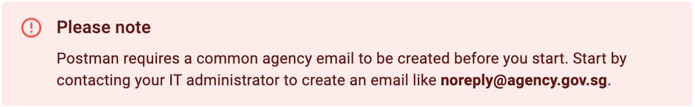
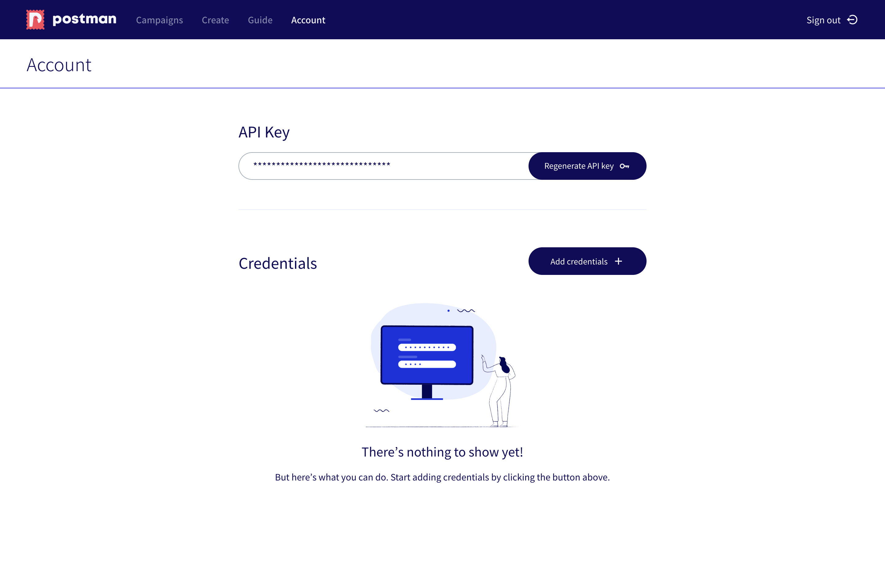
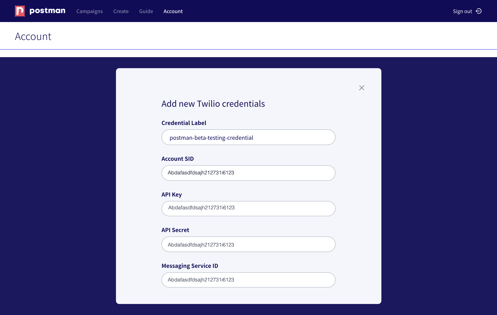
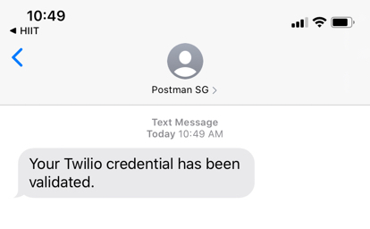
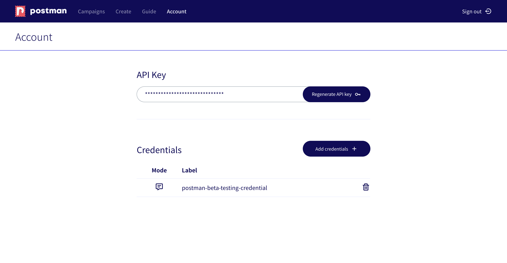
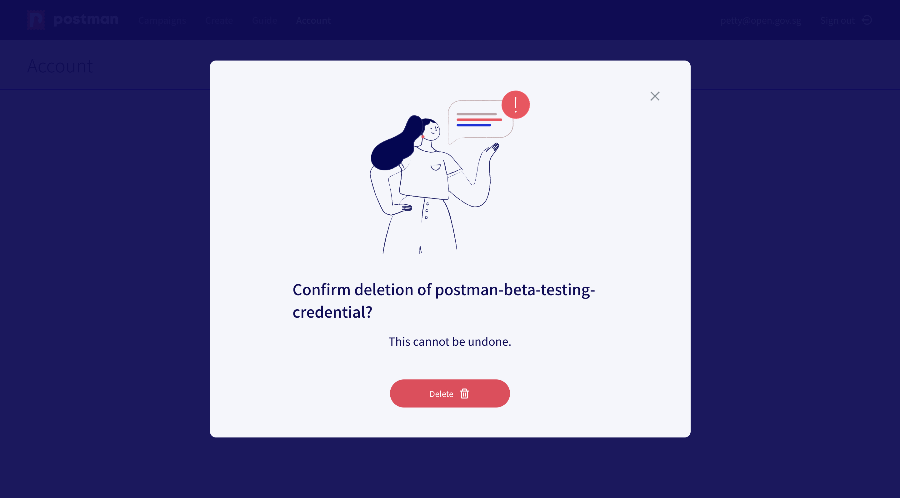
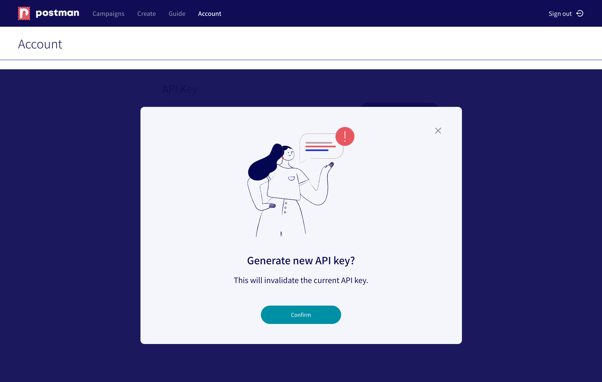
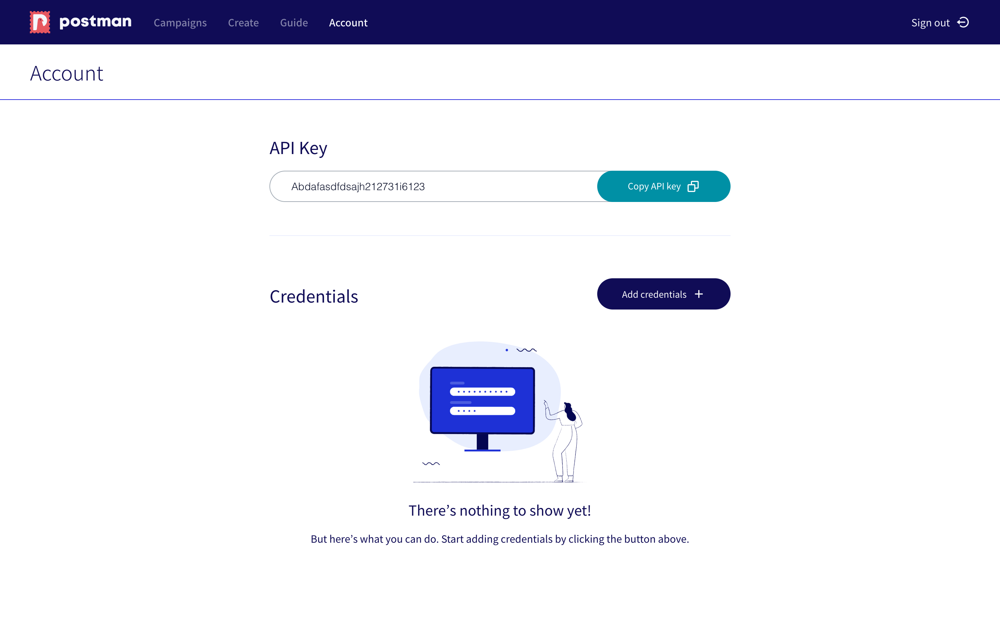
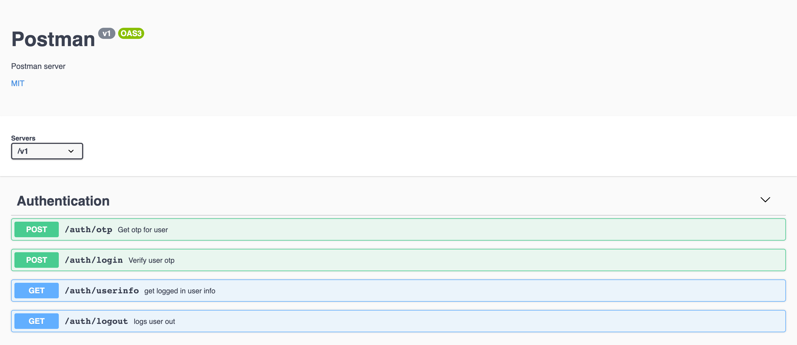

# Section 1: Before You Start

## Create a common email
Your login will be the primary email address that we will use to send your emails out to the recipients. Postman does not manage users for an agency. Twilio and WhatsApp credentials will be tied to an agency email account. You might have to contact your IT administrator to create a common email account that allows multiple subscribers. The primary advantage of such set-up is that the past campaigns can be seen under one account for audit purpose. 

## Can I have multiple users from the same agency sharing the same account?
Sharing is caring! All users from the same agency should share one account. The rationale behind our set-up is that communications out to the public should be vetted before you press send. Each agency has its own communication guidelines & policy. 

We leave it up to the communication team to govern the usage of Postman. If you are sending a message broadcast to the entire country, please make sure you get your use case vetted by the [Ministry of Communications and Information](https://www.mci.gov.sg/ "Ministry of Communications and Information").  

## Save your credentials

Think of credentials as a passcode that you need to enter into a keypad in order to get into a door. We need your credentials to contact Twilio’s API. Different services would have different credential set-up. This guide will teach you how to get them and where to save them (see below).

### Step 1: Go to account

### Step 2: Add in your Twilio credentials

### Step 3: Put in your mobile number to validate your credential

Receive a succes message once your credential has been validated. 

An SMS will also be sent to your mobile number.

You can go back to **campaigns** to start sending your SMS. The testing message page will have a dropwdown menu for you to select the credentials that you have saved in accounts. You can also choose to enter in a new set of credentials under campaign. The credentials entered for the campaign is only specific to that particular campaign. It **will not be saved**. 

## Remove your credentials

There is no preview for the credentials saved yet (work in progress). Remove your credential by clicking on the trash icon. 

We will prompt you to make sure that it is the credential that you want to delete. Deletion is not reversible. 

## Request a set of trial credentials for SMS sending. 

Please fill out the following [form](https://form.gov.sg/5ebcd3b652407a00116942ec "FormSG form") and we will reach out to you.  

## Generate an API key

If you would like to use Postman API to send SMS or email, you need to first enter in your credentials under [accounts](./before-you-start.html#save-your-credentials "credentials").  

Copy the API key and you can start using Postman's API to send SMS or email. 

## Swagger

 Please visit our [swagger](https://api-staging.postman.gov.sg/docs/ "Postman Swagger File")  documentation for more information about [Postman's API]( https://api-staging.postman.gov.sg/docs/ "Postman Swagger File") 
 
