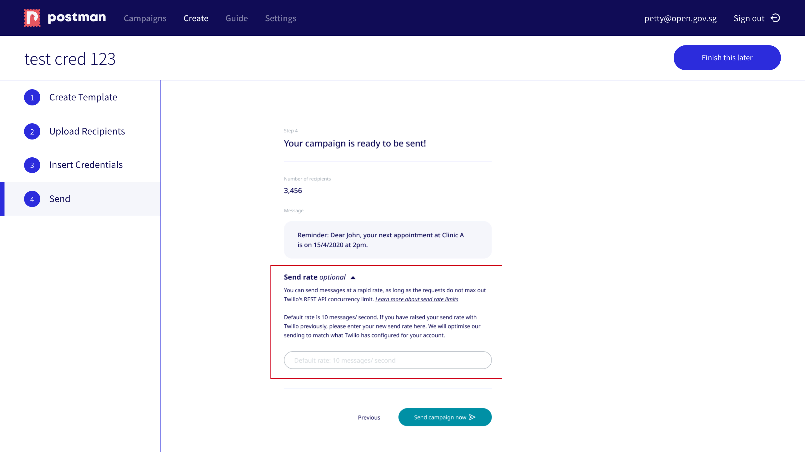

# Section 3: Power User

## Send rate
Baseline sending rate for Twilio is at 10 messages per second. You do not need to put in anything if you don't have a custom send rate from Twilio. 

If you contacted Twilio to increase your send rate because you send > 10k SMS at a time and require the SMS to be quickly sent out before the next batch, you can easily put in your send rate in step 4 right before sending your campaign (see redbox). Just let us know your Twilio send rate and Postman will adjust our tools to aim at that send rate. 

