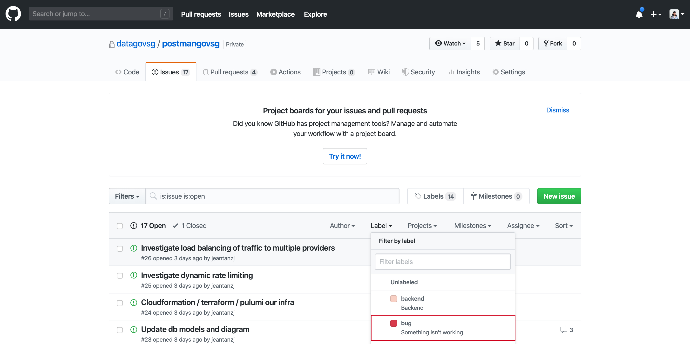

# Section 5: Report Bugs 

## Found a Bug?
Please read through the following before you report a bug. 

1. **Found a bug? Check if the bug is known.** Someone else might have caught the same bug as you. Please check whether or not the bug you are experiencing is documented in our [Github](https://github.com/datagovsg/postmangovsg/issues/ "Postman Github").

2. **Report it immediately.** Reporting a bug is like reporting news. Timeliness matters! Report it while it is fresh in your head. 

3. **Reproduce the bug more than one time before you report it.** Bugs should be reproducible. Go through the same steps to see if the same bug occurred. If your bug is not reproducible, you can still file a bug report but be sure to mention its sporadic nature.

4. **Detailed summary.** Identify exactly what the problem is. It helps us greatly if you can tell us exactly what is wrong and how to reproduce the bug. Let us know which browser you used. Copy and paste the entire error message (if any) in your report. 

5. **Screenshots, videos, log files.** This is how our internal team communicates when there is a bug. A screenshot is worth a thousand words! 

**Submit a [Bug Report](https://form.gov.sg/5e8db1736d789b0011743202/ "Postman Bug Report")**