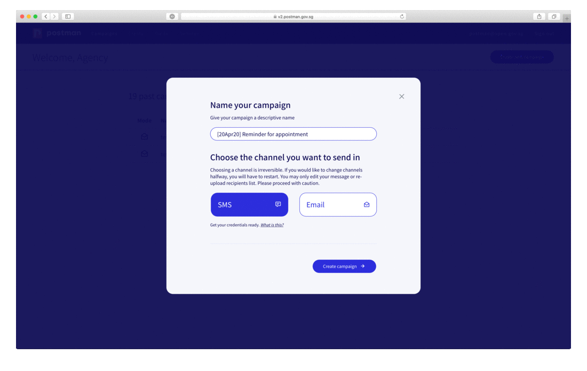
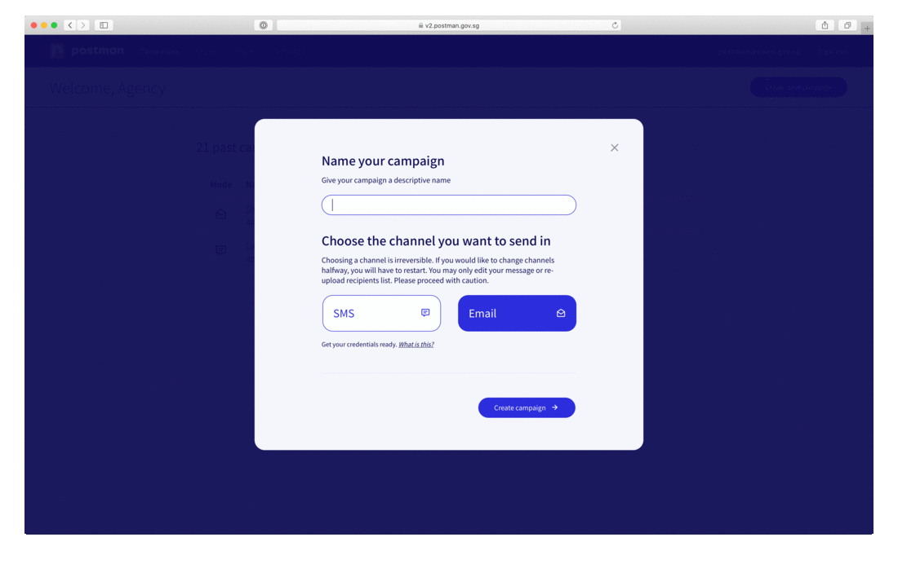

# Section 2: Step by Step Guide

## Step 1: Create a Message Template

Postman allows you to control how much personalisation should be sprinkled in each message. Message templates can be used in a few ways:

| Message Template                                                                          | Use Cases                    | 
| :-----------------------------------------------------------------------------------------| :--------------------------  | 
| No { }                                                                                   | Generic message for everyone  | 
| Mostly standardised content with a few { } like {name} {item} for fields that are relevant| Appointment reminder         | 
| {message}                                                                                 | Unique message for everyone  |

## Step 2: Set up a CSV contact list

Most of our users have an internal database that includes all of their contact.You can export the contact list in a csv file. 

Download the SMS campaign [csv template](https://drive.google.com/file/d/1kwYZQVOTrehUe9-iHMBh2OHNrTQAHsD-/view?usp=sharing "Postman csv template") for reference. 

* Make sure the headers are in **lowercase**.
* Make sure there is a field call **recipient** that will contain the phone number or email address. 
* Email should be formatted like **abc@gmail.com**.
* Phone number should be formmated like **88888888** with no space, no dash, and no +65. 

## Example: SMS flow

## Example: Email flow

