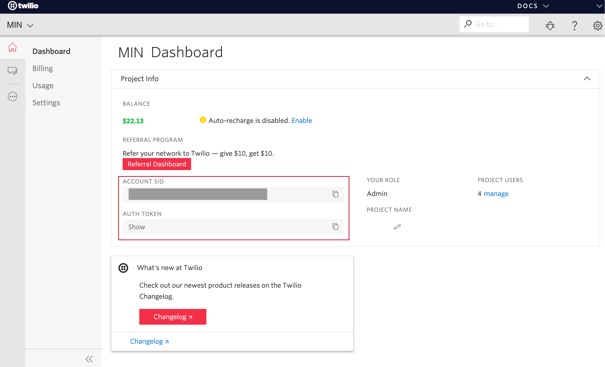
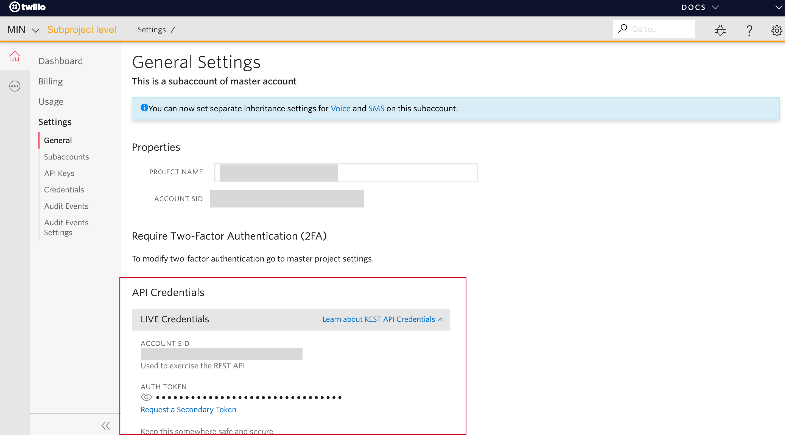
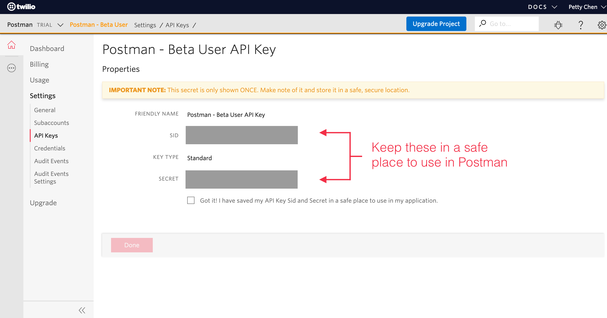
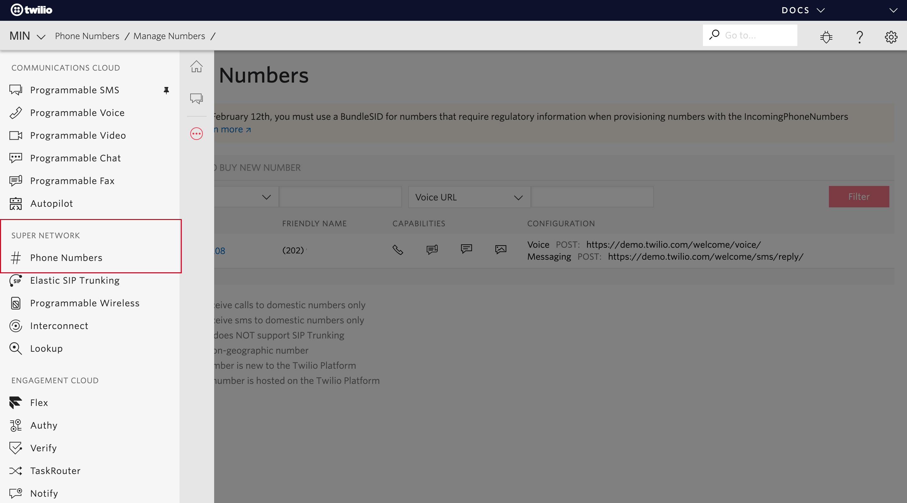
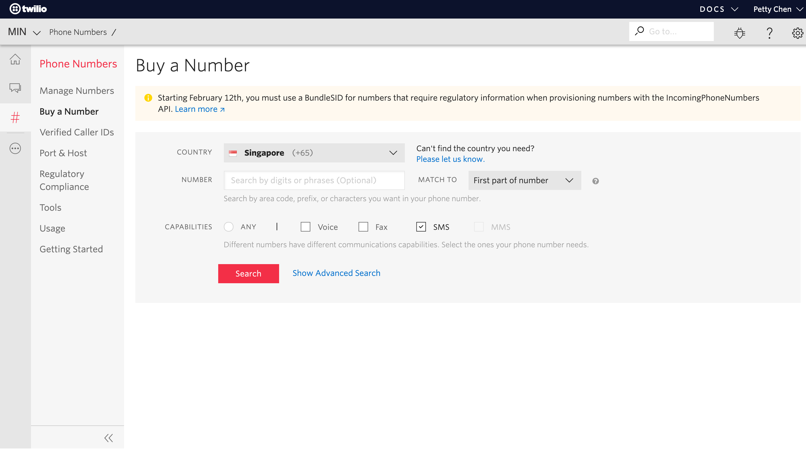

# Section 1a: Twilio & SMS

## What is Twilio?
[Twilio](https://www.twilio.com/ "Twilio's Homepage") is a cloud communication service that allows the users to send messages through an Application Program Interface (API).

## How is Postman different from Twilio?
1. **UI** 
    * Postman provides a user friendly interface for users to easily access what Twilio has to offer. 

2. **API**
    * Optimises the **rate limit** to send messages in bulk
    * Allows the user to **cancel** the campaign 
    * Allows the user to **retry** for messages that encounter errors during the first attempted delivery

## Why did Postman choose Twilio?
We evaluated other cloud service providers before we chose Twilio. We have used Twilio for SMS sending service for NDP ticketing, Digital MC, SGH's elective surgery appointment receipt and reminder, MOH's quarantine notice, and ICA's location checking for those who are on quarantine notice. 

**Easy to setup & well documented API**

Twilio, Nextmo and AWS SNS are all cloud base SMS solutions. Twilio’s primary benefit is that there is a simple user interface with an interactive debugger. Our developers have experiences integrating with Twilio. Twilio is known for its simple, and well documented API. Given that it is easy for us to integrate with Twilio and save significant manpower hours on setting up our own SMS gateway, Twilio was chosen as the service provider. 

**Reliability & availability**

Twilio API success rate is 99.999% & uptime is ~ 99.95% (per month)
Nexmo does not publicly declare its API success rate and uptime
AWS does not publicly declare its API success rate but uptime is ~99.90% (per month).

## How can I sign-up for a Twilio account?
You can go to [Twilio.com](https://www.twilio.com/ "Twilio's Homepage") to sign up for an account. Twilio provides simple and flexible [pricing plans](https://www.twilio.com/pricing "Twilio's Pricing") for different tiers of users. 

| Payment Schemes          | What do you need?                  | 
| :-----------------------| :--------------------------------  | 
| Pay-as-you-go           | Corporate credit card              | 
| Volume discount         | Procure by contacting Twilio sales | 
| Committed-use discounts | Procure by contacting Twilio sales | 

## Where can I find credentials on the Twilio console?

## 1. Account SID & Auth Token
Your credentials should be on the dashboard when you login to Twilio's console.  

An alternative way to access your credential is through **Project > Project Settings > API Credentials**.

This is particularly useful for a large agency with many users. Your agency might ask you to create a subproject in Twilio to track your usage. An example would be **MOE** at the **project level** and **Course: ecology 101** at the **subproject level** for ecology 101's teacher to send SMS to parents. 

If you fall under a subproject, you need to navigate to **Project > Project Settings > Subproject > "Subproject name like Course: ecology 101" > Settings > General** to obtain your subproject SID. Twilio console will indicate that you are viewing settings under a subproject using an orange font on the navigation bar. 

## 2. Set up a Standard API Key

Click on **Create new API Key**.

Create a new **standard** API key. You can rename the friendly name. 

We need your **SID** and **secret** for Postman. Please keep these safe. Remember to save the **secret** somewhere before you click on **Done**. 

## 3. Set up Messaging Service

Click on **Create new Messaging Service**.

Create a **new messaging service**. You can rename the friendly name. 

Select drop the message & press save. 

Go back to **SMS > Messaging Service**. You will see the newly created messaging service. You can click on it to buy a phone number. 

## 4. Buy a number
You can use a US number and mask the number with an [alphanumeric sender ID](https://support.twilio.com/hc/en-us/articles/223181348-Getting-Started-with-Alphanumeric-Sender-ID-for-Twilio-Programmable-SMS/
 "Twilio alphanumeric sender ID"). Singapore number is only needed for 2-way SMS. Postman will support 1-way SMS at the start. 

You need to purchase a phone number to start using Postman. 

You need to complete a regulatory bundle first before you can buy a number. It will ask for an ID and business details for verification. 

Once your application for regulatory bundle has been approved then you can search for a phone number based on the country code. 

Singapore phone number is $75 per month. We recommend that you buy a US phone number which is $1 per month if you are not doing 2-way messaging. SMS cost depends on the country code of the phone number. Please take note that a US phone number might cost more to send SMS. 

## 5. Manage Phone number
Go to **Phone Numbers** to buy a new number and select a number. This will be the number that we will use to send your messages. 

